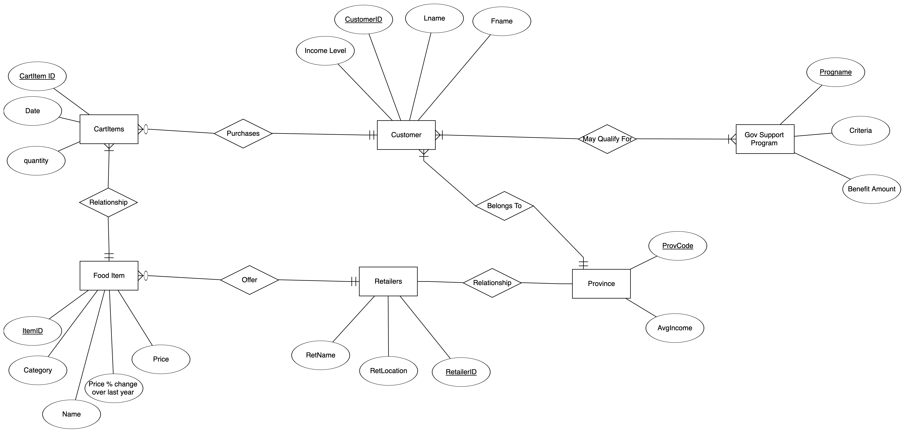

# BSAD-384-Portfolio-Project
Problem Statement
Food insecurity is a growing issue in Canada, with rising grocery prices making it difficult for individuals and families to afford nutritious meals. The Food Insecurity & Grocery Affordability Tracker aims to analyze food price trends, affordability across regions, and potential solutions. The system will integrate open data sources on grocery prices and inflation trends, allowing users to:
•	Track food price fluctuations over time.
•	Compare grocery affordability by region.
•	Identify budget-friendly food options.
•	Predict future price trends using analytical tools.

Scope:

Tracking food prices from various sources.
Comparing affordability across regions in Canada.
Providing insights into the impact of inflation on food security.
Simulating transaction data for user grocery purchases.

Data Sources:
Canada Open Data Portal (StatsCan): Food price index, inflation reports
Simulated Transaction Data

Assumptions:
All users belong to a specific region that impacts affordability.
Food price data is either sourced from open datasets or simulated for consistency.
Inflation rates and affordability metrics vary by province/region.
Government programs help offset food insecurity, affecting purchasing behavior.

Constraints:
Data availability: Some real-time food price APIs may be unavailable or restricted.
Privacy considerations: User income levels and purchasing behavior need anonymization.
Data freshness: Price and inflation data must be updated regularly to remain accurate.

## Entity Relational Model

## Relational Model

## Source Code

* [Create Script (DDL](create.sql)
* [Query Script (SQL)](Query.sql)
* [Populate Script (DML)](populate.sql)

### Query 1
'''
SELECT 
    P.ProvCode, 
    AVG(C.IncomeLevel) AS AvgIncome
FROM 
    Province P
JOIN 
    Customer C ON P.ProvCode = C.ProvCode
GROUP BY 
    P.ProvCode
ORDER BY 
    AvgIncome DESC;
'''

### Query 2
SELECT 
    F.Name AS ItemName, 
    R.RetName AS RetailerName, 
    R.RetLocation
FROM 
    FoodItem F
JOIN 
    Retailers R ON F.RetailerID = R.RetailerID
ORDER BY 
    F.Name;
### Query 3
SELECT 
    C.Fname, 
    C.Lname, 
    G.ProgName AS SupportProgram
FROM 
    Customer C
JOIN 
    MayQualifyFor MQF ON C.CustomerID = MQF.CustomerID
JOIN 
    GovSupportProgram G ON MQF.ProgName = G.ProgName
WHERE 
    C.IncomeLevel < 60000  
ORDER BY 
    C.Lname, C.Fname;
### Query 4

List of Customers and their Purchased Items with Total Quantity

SELECT 
    C.Fname, 
    C.Lname, 
    F.Name AS ItemName, 
    CI.Quantity
FROM 
    CartItems CI
JOIN 
    Customer C ON CI.CustomerId = C.CustomerID
JOIN 
    FoodItem F ON CI.ItemID = F.ItemID
ORDER BY 
    C.Lname, C.Fname;

### Query 5
SELECT 
    G.ProgName, 
    SUM(G.BenefitAmount) AS TotalBenefits
FROM 
    GovSupportProgram G
GROUP BY 
    G.ProgName
ORDER BY 
    TotalBenefits DESC;
